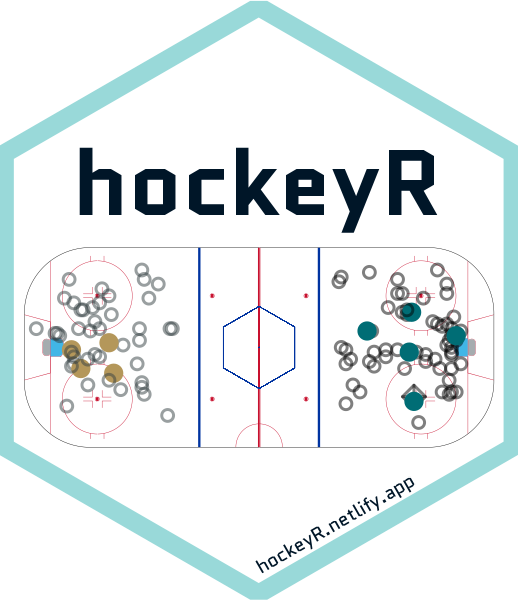

<!-- README.md is generated from README.Rmd. Please edit that file -->

```{r, include = FALSE}
knitr::opts_chunk$set(
  collapse = TRUE,
  comment = "#>",
  fig.path = "man/figures/README-",
  out.width = "100%",
  dpi=750,fig.width=7
)
```

# hockeyR 

<!-- badges: start -->
[](https://CRAN.R-project.org/package=hockeyR)
[](https://github.com/hockeyR)
[](https://github.com/danmorse314/hockeyR/actions)
[](https://github.com/danmorse314/hockeyR/commits/master)
[](https://cran.r-project.org/package=hockeyR)
[](https://twitter.com/danmorse_)
<!-- badges: end -->

This package contains various functions to scrape and clean play-by-play data from NHL.com. Season play-by-play data scraped with these functions can be found in the [hockeyR-data](https://github.com/danmorse314/hockeyR-data) repository. It also contains functions to scrape data from [hockey-reference.com](https://www.hockey-reference.com/), including standings, player stats, and jersey number history.

## Installation


Install the released version of hockeyR from [CRAN](https://CRAN.R-project.org) with:
  
  ``` r
install.packages("hockeyR")
```

Alternatively, you can install the development version of `hockeyR` from [GitHub](https://github.com/) with:

``` r
# install.packages("devtools")
devtools::install_github("danmorse314/hockeyR")
```
## Usage

Load the package (and any others you might need—for plotting an ice surface I highly recommend the [sportyR](https://github.com/sportsdataverse/sportyR) package).

```{r, echo = TRUE, results='hide', message=FALSE, warning=FALSE}
library(hockeyR)
library(tidyverse)
library(sportyR)
```

#### Loading season play-by-play

The fastest way to load a season's play-by-play data is through the `load_pbp` function, which pulls the desired season(s) from [hockeyR-data](https://github.com/danmorse314/hockeyR-data/tree/main/data). `load_pbp` also has the advantage of accepting more explicit values for the seasons desired. For example, if you want to get the play-by-play for the 2020-2021 NHL season, all of `load_pbp('2020-2021')`, `load_pbp('2020-21')`, and `load_pbp(2021)` will get it for you. The option `shift_events` is a logical value indicating whether or not to load the play-by-play data with specific shift change events. The default is to exclude them, which cuts the size of the data in half and still leaves the most important events like shots, penalties, and faceoffs. Data without shift events **does still include** columns for players on the ice at the time of each event.

```{r load_pbp}
pbp <- load_pbp('2018-19')
```
The available data goes back to the 2010-2011 season as of now, as the NHL JSON source used for this scraper doesn't include detailed play-by-play prior to that.

All variables available in the raw play-by-play data are included, along with a few extras added on including:

* shot_distance
* shot_angle
* x_fixed
* y_fixed

The `shot_distance` and `shot_angle` are measured in feet and degrees, respectively. The variables `x_fixed` and `y_fixed` are transformations of the `x` and `y` event coordinates such that the home team is always shooting to the right and the away team is always shooting to the left. For full details on the included variables, see the [`scrape_game`](https://github.com/danmorse314/hockeyR/blob/master/R/scrape_game.R) documentation.

#### NEW in hockeyR v1.1.0: Expected Goals

As of `hockeyR` v1.1.0, a new column has been added to the play-by-play data: Expected goals! The `hockeyR` package now includes its own public expected goals model, and every unblocked shot in the play-by-play data now has an `xg` value. A full description of the model, including the code used to construct it and the testing results, can be found in the [hockeyR-models](https://github.com/danmorse314/hockeyR-models) repository. Users can now investigate additional statistics, such as player goals above expectation without having to create their own entire model.

```{r xg-example}
pbp %>%
  filter(event_type %in% c("SHOT","MISSED_SHOT","GOAL")) %>%
  group_by(player = event_player_1_name, id = event_player_1_id) %>%
  summarize(
    team = last(event_team_abbr),
    goals = sum(event_type == "GOAL"),
    xg = round(sum(xg, na.rm = TRUE),1),
    gax = goals - xg,
    .groups = "drop"
  ) |>
  arrange(-xg) |>
  slice(1:10)
```

#### Shot Plots

An easy way to create a shot plot is through the [sportyR](https://github.com/sportsdataverse/sportyR) package. You can also use the included `team_colors_logos` data to add color and team logos to your plots.

```{r shot-plot-example}
# get single game
game <- pbp %>%
  filter(game_date == "2019-04-23" & home_abbreviation == "SJS")

# grab team logos & colors
team_logos <- hockeyR::team_logos_colors %>%
  filter(team_abbr == unique(game$home_abbreviation) | team_abbr == unique(game$away_abbreviation)) %>%
  # add in dummy variables to put logos on the ice
  mutate(x = ifelse(full_team_name == unique(game$home_name), 50, -50),
         y = 0)

# add transparency to logo
transparent <- function(img) {
  magick::image_fx(img, expression = "0.3*a", channel = "alpha")
}

# get only shot events
fenwick_events <- c("MISSED_SHOT","SHOT","GOAL")

shots <- game %>% filter(event_type %in% fenwick_events) %>%
  # adding team colors
  left_join(team_logos, by = c("event_team_abbr" = "team_abbr"))

# create shot plot
geom_hockey("nhl") +
  ggimage::geom_image(
    data = team_logos,
    aes(x = x, y = y, image = team_logo_espn),
    image_fun = transparent, size = 0.22, asp = 2.35
    ) +
  geom_point(
    data = shots,
    aes(x_fixed, y_fixed),
    size = 6,
    color = shots$team_color1,
    shape = ifelse(shots$event_type == "GOAL", 19, 1)
    ) +
  labs(
    title = glue::glue("{unique(game$away_name)} @ {unique(game$home_name)}"),
    subtitle = glue::glue(
    "{unique(game$game_date)}\n
    {unique(shots$away_abbreviation)} {unique(shots$away_final)} - {unique(shots$home_final)} {unique(shots$home_abbreviation)}"
    ),
    caption = "data from hockeyR | plot made with sportyR"
    ) +
  theme(
    plot.title = element_text(hjust = 0.5),
    plot.subtitle = element_text(hjust = 0.5),
    plot.caption = element_text(hjust = .9)
    )
```

### More scraping functions

In addition to the play-by-play data, `hockeyR` also provides access to a few other endpoints in the NHL's API. You can scrape the current official rosters for all NHL teams using the `get_current_rosters` function. This pulls the rosters directly from the NHL at the time you run the function, and will provide the most up-to-date info on team rosters, including player positions, jersey numbers, and player IDs.

```{r roster-example}
rosters <- get_current_rosters()

rosters %>%
  select(player, jersey_number, position, team_abbr, everything()) %>%
  head()
```

It's also possible to access the draft selections and order of selections for every NHL Entry Draft back to 1963 (the first year the NHL held an Entry Draft). By default, this function returns only information on the pick number, the team, and the players' names and player IDs -- it runs much faster this way. For more details, including player heights, weights, birthplaces, and amateur teams, set the `player_details` argument to `TRUE`.

```{r draft-example}
draft <- get_draft_class(draft_year = 2022, player_details = TRUE)

draft %>%
  select(draft_year, round, pick_overall, full_team_name, player, everything()) %>%
  head()
```
There are also several scrapers designed to pull statistics from [hockey-reference.com](https://www.hockey-reference.com/). For more information on these scrapers and what they can do, please see the [Scraping hockey-reference.com](https://hockeyr.netlify.app/articles/hockey-ref-scrapers.html) vignette.

### Future Work

Getting clean data for games going back to the start of the NHL RTSS era (2007-2008 season) is in the works. There are also plans to create a basic expected goals model and perhaps a win probability model that would include xG values for each shot and win probabilities for each play, similar to the expected points model found in the [nflfastR](https://github.com/nflverse/nflfastR) package. And of course, scraping the upcoming NHL season and updating the data daily is planned for the 2022-23 season.

##    Acknowledgments

* Everyone involved in making the [nflverse](https://github.com/nflverse), the premier data source for NFL stats that inspired this whole project
* The [Evolving Wild](https://twitter.com/EvolvingWild) twins, whose old NHL scraper helped enormously in getting player on-ice data joined to the raw play-by-play data in here.
* [Tan Ho](https://twitter.com/_TanHo), whose twitch streams on [web scraping](https://www.youtube.com/watch?v=z8yT3E4pz54&t=26s) and [JSON wrangling](https://www.youtube.com/watch?v=fpw4G2-0R-o&t=1195s) quite literally took me from 0 web scraping knowledge to building this package
