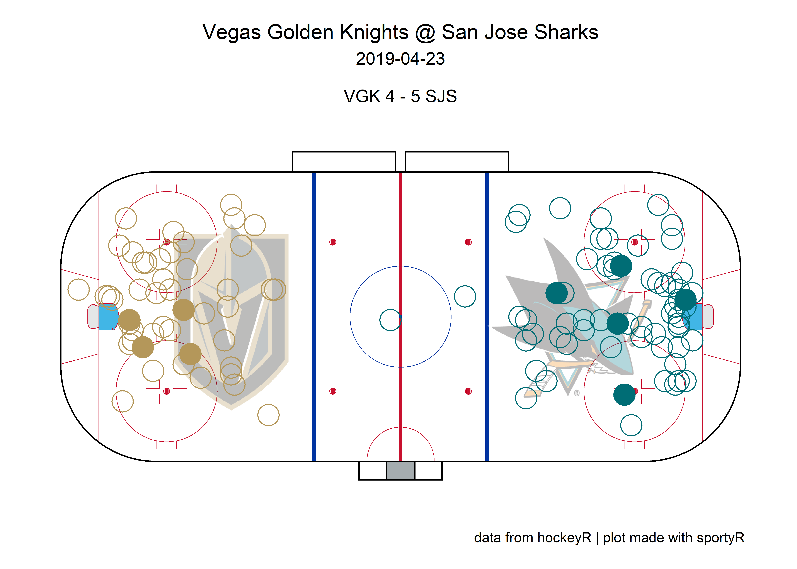

<!-- README.md is generated from README.Rmd. Please edit that file -->

# hockeyR

<!-- badges: start -->
<!-- badges: end -->

This package contains various functions to scrape and clean play-by-play
data from NHL.com. Season play-by-play data scraped with these functions
can be found in the
[hockeyR-data](https://github.com/danmorse314/hockeyR-data) repository.
It also contains functions to scrape data from hockey-reference.com,
including standings, player stats, and jersey number history.

## Installation

Before installing, confirm that your version of R is updated to at least
4.1.0. This will ensure R can handle R’s native pipe operator `|>`,
which was unavailable until 4.1.0. If you don’t know which version of R
is installed, try `verson$version.string` in your R console.

``` r
version$version.string
#> [1] "R version 4.1.0 (2021-05-18)"
```

You can install the development version of `hockeyR` from
[GitHub](https://github.com/) with:

``` r
# install.packages("devtools")
devtools::install_github("danmorse314/hockeyR")
```

## Usage

Load the package (and any others you might need—for plotting an ice
surface I highly recommend the
[sportyR](https://github.com/rossdrucker/sportyR) package).

``` r
library(hockeyR)
library(tidyverse)
#> Warning: package 'ggplot2' was built under R version 4.1.1
library(sportyR)
```

#### Loading season play-by-play

The fastest way to load a season’s play-by-play data is through the
`load_pbp()` function, which pulls the desired season(s) from
[hockeyR-data](https://github.com/danmorse314/hockeyR-data/tree/main/data).
`load_pbp()` also has the advantage of accepting more explicit values
for the seasons desired. For example, if you want to get the
play-by-play for the 2020-2021 NHL season, all of
`load_pbp('2020-2021')`, `load_pbp('2020-21')`, and `load_pbp(2021)`
will get it for you.

``` r
pbp <- load_pbp('2020-21')
#> Fetching 2020_21 season play-by-play...
#> Done!
```

The available data goes back to the 2010-2011 season as of now, as the
NHL JSON source used for this scraper doesn’t include detailed
play-by-play prior to that.

All variables available in the raw play-by-play data are included, along
with a few extras added on including: - shot\_distance - shot\_angle -
x\_fixed - y\_fixed The `shot_distance` and `shot_angle` are measured in
feet and degrees, respectively. The variables `x_fixed` and `y_fixed`
are transformations of the `x` and `y` event coordinates such that the
home team is always shooting to the right and the away team is always
shooting to the left. For full details on the included variables, see
the
[`scrape_game()`](https://github.com/danmorse314/hockeyR/blob/master/R/scrape_game.R)
documentation.

As mentioned above, an easy way to create a shot plot is through the
[sportyR](https://github.com/rossdrucker/sportyR) package. You can also
use the included `team_colors_logos` data to add color and team logos to
your plots.

``` r
# get single game
game <- pbp |>
  filter(game_date == "2021-07-07" & home_abbreviation == "TBL")

# grab team logos & colors
team_logos <- hockeyR::team_logos_colors |>
  filter(team_abbr == unique(game$home_abbreviation) | team_abbr == unique(game$away_abbreviation)) |>
  # add in dummy variables to put logos on the ice
  mutate(x = ifelse(full_team_name == unique(game$home_name), 50, -50),
         y = 0)

# add transparency to logo
transparent <- function(img) {
  magick::image_fx(img, expression = "0.5*a", channel = "alpha")
}

# get only shot events
fenwick_events <- c("MISSED_SHOT","SHOT","GOAL")

shots <- game |> filter(event_type %in% fenwick_events) |>
  # adding team colors
  left_join(team_logos, by = c("event_team_abbr" = "team_abbr"))

# create shot plot
geom_hockey("nhl") +
  ggimage::geom_image(
    data = team_logos,
    aes(x = x, y = y, image = team_logo_espn),
    image_fun = transparent, size = 0.22, asp = 2.35
    ) +
  geom_point(
    data = shots,
    aes(x_fixed, y_fixed),
    size = 6,
    color = shots$team_color1,
    shape = ifelse(shots$event_type == "GOAL", 19, 1)
    ) +
  labs(
    title = glue::glue("{unique(game$away_name)} @ {unique(game$home_name)}"),
    subtitle = glue::glue(
    "{unique(game$game_date)}\n
    {unique(shots$away_abbreviation)} {unique(shots$away_final)} - {unique(shots$home_final)} {unique(shots$home_abbreviation)}"
    ),
    caption = "data from hockeyR | plot made with sportyR"
    ) +
  theme(
    plot.title = element_text(hjust = 0.5),
    plot.subtitle = element_text(hjust = 0.5),
    plot.caption = element_text(hjust = .9)
    )
```



#### Future Work

Getting clean data for games going back to the start of the NHL RTSS era
(2007-2008 season) is in the works. There are also plans to create a
basic expected goals model and perhaps a win probability model that
would include xG values for each shot and win probabilities for each
play, similar to the expected points model found in the
[nflfastR](https://github.com/nflverse/nflfastR) package. And of course,
scraping the upcoming NHL season and updating the data daily is planned
for the 2021-2022 season.

### Hockey-Reference scrapers

There are a few functions also included that will scrape data from
[hockey-reference.com](https://hockey-reference.com).

Grab every team’s win-loss record in any season going back to 1918 with
the `get_team_records()` function

``` r
get_team_records(1967) |>
  arrange(desc(w)) |>
  select(team_name, team_abbr, season, overall, w, l, otl, st_points)
#> # A tibble: 6 x 8
#>   team_name           team_abbr season  overall      w     l   otl st_points
#>   <chr>               <chr>     <chr>   <chr>    <int> <int> <int>     <dbl>
#> 1 Chicago Black Hawks CBH       1966-67 41-17-12    41    17    12        94
#> 2 Montreal Canadiens  MTL       1966-67 32-25-13    32    25    13        77
#> 3 Toronto Maple Leafs TOR       1966-67 32-27-11    32    27    11        75
#> 4 New York Rangers    NYR       1966-67 30-28-12    30    28    12        72
#> 5 Detroit Red Wings   DET       1966-67 27-39-4     27    39     4        58
#> 6 Boston Bruins       BOS       1966-67 17-43-10    17    43    10        44
```

You can also get stats down to the player-level with
`get_player_stats_hr()`. This function defaults to the player’s career
statistics, but you can enter a specific season or range of seasons as
well. Note that the season references the year the specific season ended
(ie the 2021-22 season should be entered as 2022)

``` r
get_player_stats_hr(player_name = "Wayne Gretzky", season = 1982) |>
  select(player, age, season_full, tm, gp, g, a, pts)
#> # A tibble: 1 x 8
#>   player          age season_full tm       gp     g     a   pts
#>   <chr>         <int> <chr>       <chr> <int> <int> <int> <int>
#> 1 Wayne Gretzky    21 1981-82     EDM      80    92   120   212
```

Ever wonder who the most prolific goal-scorer was to wear a specific
number? Use `get_jersey_players()` in conjunction with
`get_player_stats_hr()` to find out:

``` r
# get every player to wear the desired number
df <- get_jersey_players(98)

# get their statistics from the year they wore that sweater
df2 <- purrr::map2_dfr(
  .x = df$player,
  .y = df$season,
  ~get_player_stats_hr(player_name = .x, season = .y)
  )

# who had the most goals?
arrange(df2, desc(g)) |>
  select(player, tm, season_full, gp, g, a, pts)
#> # A tibble: 11 x 7
#>    player            tm    season_full    gp     g     a   pts
#>    <chr>             <chr> <chr>       <int> <int> <int> <int>
#>  1 Jesse Puljujarvi  EDM   2017-18        65    12     8    20
#>  2 Brian Lawton      MNS   1983-84        58    10    21    31
#>  3 Mikhail Sergachev TBL   2019-20        70    10    24    34
#>  4 Mikhail Sergachev TBL   2017-18        79     9    31    40
#>  5 Mikhail Sergachev TBL   2018-19        75     6    26    32
#>  6 Brian Lawton      MNS   1984-85        40     5     6    11
#>  7 Jesse Puljujarvi  EDM   2018-19        46     4     5     9
#>  8 Mikhail Sergachev TBL   2020-21        56     4    26    30
#>  9 Victor Mete       OTT   2020-21        14     1     1     2
#> 10 Jesse Puljujarvi  EDM   2016-17        28     1     7     8
#> 11 Victor Mete       MTL   2020-21        14     0     3     3
```

You can use the data to make plots with actual team colors and logos as
well using the `team_logos_colors` file included with the package.

``` r
# add colors & logos
df3 <- df2 |>
  group_by(player, season_full) |>
  # this part is just to get both of Mete's teams into one row
  summarize(
    gp = sum(gp),
    pts = sum(pts),
    pts_gm = pts/gp,
    tm = tail(tm, n=1),
    .groups = "drop"
  ) |>
  mutate(player_season = glue::glue("{player}\n{season_full}")) |>
  left_join(team_logos_colors, by = c("tm" = "team_abbr"))

# make a bar chart
df3 |>
  ggplot(aes(reorder(player_season, -pts_gm), pts_gm)) +
  geom_col(fill = df3$team_color1, color = df3$team_color2) +
  ggimage::geom_image(
    aes(y = pts_gm + .027, image = team_logo_espn),
    size = .07, asp = 1.5
  ) +
  geom_text(aes(y = 0.01, label = player_season),
            color = "white", angle = 90, hjust = 0) +
  scale_y_continuous(breaks = scales::pretty_breaks()) +
  theme(
    panel.background = element_rect(fill = "black"),
    plot.background = element_rect(fill = "black"),
    panel.grid.major.x = element_blank(),
    axis.text.x = element_blank(),
    axis.ticks.x = element_blank(),
    axis.text.y = element_text(color = "white"),
    title = element_text(color = "white")
  ) +
  labs(x = NULL, y = "Points per game",
       title = "Most productive NHL seasons wearing #98",
       caption = "data pulled from hockey-reference.com using hockeyR")
```

 The
most reliable way to grab player stats is through the `get_rosters()`
function. The `get_player_stats_hr()` function still has some kinks to
be worked out, as it works based on the player name (and messes up if
you want to differentiate the Sebastian Ahos).

With `get_rosters()`, you can look up the current roster for any team in
the league or the roster at season’s end for any prior season. By
default, it will only pull basic player info (name, age, height &
weight, etc), but you can grab all the basic counting stats by setting
`include_stats` to `TRUE`.

``` r
player_stats <- get_rosters(c("COL","Detroit red wings"), season = 2001, include_stats = TRUE) |>
  mutate(
    g_60 = 60 * g / toi,
    a_60 = 60 * a /toi,
    p_60 = 60 * pts / toi
  ) |>
  filter(toi >= 300) |>
  left_join(team_logos_colors, by = "team_abbr")

top_performers <- filter(
      player_stats,
      p_60 >= arrange(player_stats, -p_60) |> slice(10) |> pull(p_60)
      )

player_stats |>
  ggplot(aes(a_60,g_60)) +
  geom_hline(yintercept = 60 * sum(player_stats$g) / sum(player_stats$toi),
             linetype = "dashed", color = "black") +
  geom_vline(xintercept = 60 * sum(player_stats$a) / sum(player_stats$toi),
             linetype = "dashed", color = "black") +
  #geom_point(aes(size = toi), show.legend = FALSE,
  #           color = player_stats$team_color_alt1, alpha = .8) +
  ggimage::geom_image(aes(image = team_logo_espn),
                      size = 0.07, asp = 1.5) +
  ggrepel::geom_text_repel(
    data = top_performers,
    aes(label = player),
    color = top_performers$team_color_alt1
  ) +
  scale_y_continuous(breaks = scales::pretty_breaks()) +
  scale_x_continuous(breaks = scales::pretty_breaks()) +
  theme(
    panel.background = element_rect(fill = "#708090"),
    plot.background = element_rect(fill = "#708090"),
    title = element_text(color = "white")
  ) +
  labs(x = "Assists/60", y = "Goals/60",
       title = "2000-01 Wings v Avs, regular season stats",
       subtitle = "min. 300 minutes",
       caption = "data pulled from hockey-reference.com using hockeyR")
```


## Acknowledgements

-   Everyone involved in making the
    [nflverse](https://github.com/nflverse), the premier data source for
    NFL stats that inspired this whole project
-   The [Evolving Wild](https://twitter.com/EvolvingWild) twins, whose
    old NHL scraper helped enormously in getting player on-ice data
    joined to the raw play-by-play data in here.
-   [Tan Ho](https://twitter.com/_TanHo), whose twitch streams on [web
    scraping](https://www.youtube.com/watch?v=z8yT3E4pz54&t=26s) and
    [JSON
    wrangling](https://www.youtube.com/watch?v=fpw4G2-0R-o&t=1195s)
    quite literally took me from 0 web scraping knowledge to building
    this package
